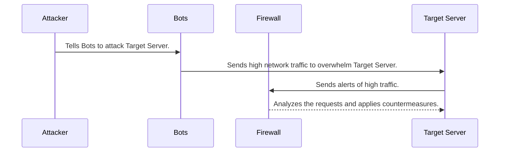

# mermaid-diagram

## Steps of the Sequence diagram:
1. The attacker makes a botnet. A botnet is the group of devices compromised by malware and they are controlled by the attacker. 2. The attacker tells the botnet to "attack" the Target server by sending requests to the Target server to overwhelm it. 
3. The Target server sends alerts of high traffic to the Firewall.
4. The Firewall analyzes the requests sent by the botnet and decides which requests to send to the Target server and which to block.

## How each participant contributes to the scenario:
* Attacker: The attacker contributes by attempting to access, influence, delete, or corrupt data that is located in the Target server. The attacker does this by creating a botnet which is used to overwhelm the Target server.
* Bots/Botnet: The Bots/Botnet contributes by using a command & control model to allow the attacker to control the actions of a group of devices from one remote location. The Bots/Botnet are used to overwhelm the Target server.
* Firewall: The Firewall contributes by providing a defense measure. The Firewall recieves all these requests from the Bots/Botnet and disallows the requests from reaching the Target server.
* Target Server: The Target Server contributes by sending reports of high traffic to the Firewall during an attack.

**Defense measures** are triggered when the requests are recieved by the Firewall. The firewall then decides which requests are safe to be sent to the Target server and which requests to disallow access to the Target server.