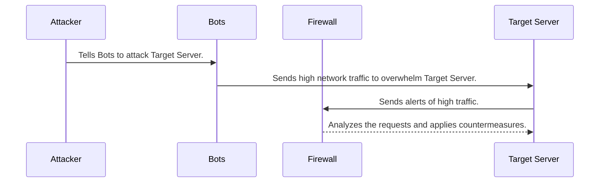

# mermaid-diagram

```mermaid
sequenceDiagram
    participant Attacker as Attacker
    participant Bots as Bots
    participant Firewall as Firewall
    participant Target as Target Server
    
    Attacker->>Bots: Tells Bots to attack Target Server. 
    Bots->>Target: Sends high network traffic to overwhelm Target Server.
    Target->> Firewall: Sends alerts of high traffic.
    Firewall-->>Target: Analyzes the requests and applies countermeasures.

```